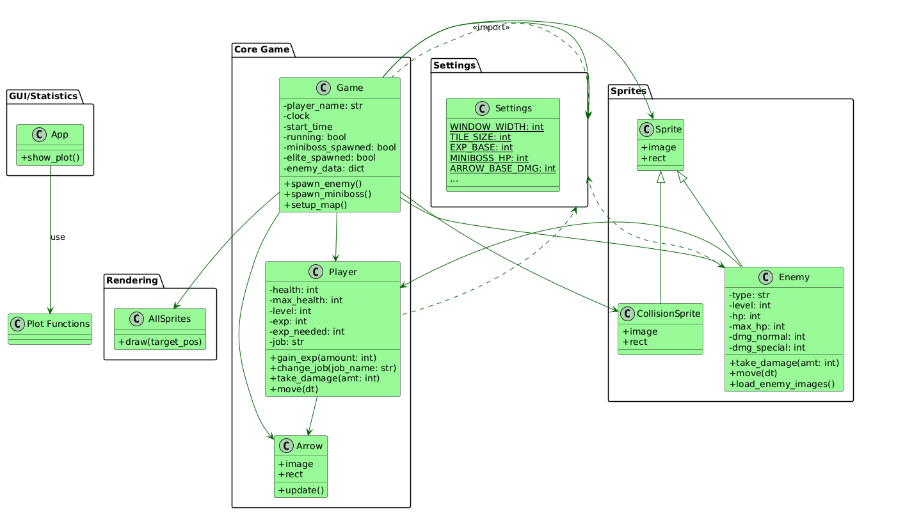

# The Last Crusade

  

---

## 📋 Table of Contents

1. [Overview](#overview)
2. [Key Features](#Key Features)
3. [Gameplay Mechanics](#gameplay-mechanics)
4. [Player Classes & Progression](#player-classes--progression)
5. [Enemy & Boss AI](#enemy--boss-ai)
6. [Technical Architecture](#technical-architecture)
7. [UML Class Diagram](#uml-class-diagram)
8. [Tech Stack](#tech-stack)
9. [Future Enhancements](#future-enhancements)

---

## Overview

**The Last Crusade** is an adrenaline-fueled 2D survival game built with **Pygame** and **Tiled**. Traverse a procedural world teeming with hazards, recruit powerful abilities, and face escalating threats culminating in an epic showdown against the Elite Orc.

Players must master both melee and ranged combat while managing cooldowns, leveling up, and strategically choosing class specializations to endure relentless waves of enemies.

---

## 🔑 Key Features

* **Dynamic Sprite Management**: Layered sprite groups (`AllSprites`, `CollisionSprites`, etc.) with a camera system to always keep the action centered.
* **Fluid Combat System**:

  * **Melee Attacks**: Left-click swings with queued animations.
  * **Ranged & Special Attacks**: Right-click casts spells or fires projectiles with cooldown management.
* **Replayable Progression**: EXP-based leveling with scalable health, damage, and skill unlocks.
* **Class Specialization**: Choose **Knight**, **Wizard**, or **Judiciar** at level 15, each offering unique stat buffs and ultimate abilities.
* **Run Logging & Analytics**: Session data (username, duration, class, level, miniboss kills, win/lose) is stored in `runs.csv` for future leaderboards or analytics.

---

## 🎮 Gameplay Mechanics

1. **Map & Exploration**

   * Designed in **Tiled**, each map layer is parsed into collision, decoration, and interaction sprites.
   * Collect health potions and EXP orbs dropped by enemies.

2. **Experience & Leveling**

   * EXP requirements follow a growth formula: `next_level_exp = base_exp * (growth_rate ^ (current_level - 1))`.
   * Upon leveling:

     * Max health resets and increases.
     * Damage output scales.
     * Access to new skills at milestone levels.

3. **Combat Flow**

   * Input buffering ensures responsive attack chains.
   * Cooldowns and animation queues prevent input locking.
   * Visual feedback via particle effects and sound cues.

---

## 🛡️ Player Classes & Progression

| Class        | Primary Stats                | Passive Bonus          | Ultimate Ability            |
| ------------ | ---------------------------- | ---------------------- | --------------------------- |
| **Knight**   | High Health, Melee Damage    | +20% Physical Defense  | Cleave Stun (AOE knockback) |
| **Wizard**   | High Mana, Ranged Power      | +15% Spell Damage      | Meteor Shower (Massive AOE) |
| **Judiciar** | Balanced, Cooldown Reduction | 10% Cooldown Reduction | Judgment Blade (Piercing)   |

---

## 👾 Enemy & Boss AI

* **Regular Spawns**: Enemy waves scale with player level; spawns trigger only when no miniboss or boss exists.
* **Minibosses**:

  * **Greatsword Skeleton** at Level 10: Heavy swings, slow movement.
  * **Werewolf** at Level 20: Fast melee rushes with bleed effect.
* **Elite Orc** (Final Boss): Spawns at Level 30 or after 10 minutes of play, featuring:

  * Multi-phase health bars.
  * Unique shield mechanic requiring ranged attacks to disable.
  * Ground smash and charge patterns.

---

## 🏗️ Technical Architecture

* **Sprite Groups & Layers**: Organized via `groups.py` for clear separation of render, update, and collision.
* **Player Logic**: Located in `player.py` — handles input, stats, animations, and interactions.
* **Settings & Constants**: Centralized in `settings.py` for easy configuration (screen size, tile size, growth rates).
* **Asset Loading & Sprites**: Managed in `sprites.py` with a sprite sheet loader and animation manager.
* **Game Loop**: Defined in `main.py`, orchestrating event handling, updates, and rendering.

---

## UML Class Diagram

---

## 🛠️ Tech Stack

* **Language**: Python 3.10
* **Engine**: Pygame 2.1
* **Map Editor**: Tiled 1.8
* **Data Storage**: CSV for run logging
* **Version Control**: Git & GitHub

---

## 🚀 Future Enhancements

* **Online Leaderboards**: Sync `runs.csv` to a backend service.
* **Additional Classes & Skills**: Expand to 5+ unique classes.
* **Procedural Level Generation**: Randomized map layouts for endless replayability.
* **Audio**: Dynamic soundtrack and voice-over cues.

---
## 📂 Project Links

- **GitHub Repository:** [https://github.com/Kantee22/The-Last-Crusade/tree/main](https://github.com/Kantee22/The-Last-Crusade/tree/main)
- **Project Proposal:** [https://docs.google.com/document/d/1YDT66A1HK4TPbdzK42oawEV7-aXaO5UC/edit?tab=t.0#heading=h.gjdgxs](https://docs.google.com/document/d/1YDT66A1HK4TPbdzK42oawEV7-aXaO5UC/edit?tab=t.0#heading=h.gjdgxs)
